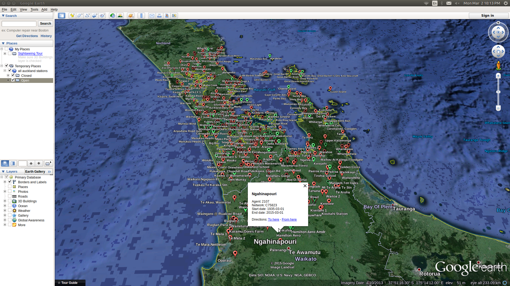

```{r, echo = FALSE}
library(clifro)
```
# Introduction

There are two functions available in `clifro` to create requisite `cfStation`
objects to send queries to retrieve data via `clifro`. The first one is to 
search for stations using the `cf_find_station` function as detailed in the 
[choose stations vignette][chooseStations]. The other function that creates
`cfStation` objects is the `cf_station` function that requires comma separated 
agent numbers as the only input. This vignette covers the construction of a 
`cfStation`  object via the `cf_station` function, and then shows examples of 
plotting and visualising the station's locations using KML files or within R
using the [ggmap](https://cran.r-project.org/package=ggmap)
package.

# Creating a cfStation object from agent numbers

This is the simplest method to create a `cfStation` object, simply supply the 
`cf_station` function the comma separated agent numbers. The following stations 
are (or were) located around Lake Tekapo in Canterbury, in the South Island of 
New Zealand:

1. Coal (Ski Field)
1. Macaulay (Mt Gerald)
1. South Opua
1. Mount John
1. Lake Tekapo Ews
1. Godley Peaks
1. Lilybank

```{r, eval = FALSE}
lake.tekapo.st = cf_station(12709, 35567, 39557, 4630, 24945, 4616, 4602)
lake.tekapo.st[, c("name", "agent", "start", "end", "open")]
```

```
##                      name agent      start                 end  open
## 1         Coal @ Skifield 12709 1989-02-01 2020-09-01 02:00:00  TRUE
## 2      Macaulay@Mt Gerald 35567 1990-07-04 2020-09-01 02:00:00  TRUE
## 3         Lake Tekapo Ews 24945 2003-06-18 2020-09-01 02:00:00  TRUE
## 4 South Opua @ South Opua 39557 2011-09-28 2020-09-01 02:00:00  TRUE
## 5        Lilybank Station  4602 1950-01-01 1992-09-30 00:00:00 FALSE
## 6                 Mt John  4630 1962-10-01 1988-01-01 00:00:00 FALSE
## 7    Godley Peaks, Tekapo  4616 1914-01-01 1976-06-01 00:00:00 FALSE
```

We can see that subsetting `lake.tekapo.st` acts just like a `data.frame` 
object, although it is technically a `cfStation` object. Most of the common 
`data.frame` methods work on `cfStation` objects.

## Adding more stations

To add more stations to this list the addition sign is used. Any repeated 
stations are removed and the resulting list is ordered by the end dates first 
and then by the stations' start dates.

```{r, eval = FALSE}
added.stations.st = lake.tekapo.st + 
  cf_station() + 
  cf_find_station("lighthouse", status = "all")
added.stations.st[, c("name", "agent", "start", "end", "open")]
```

```
##                       name agent      start        end  open
## 1              Reefton Ews  3925 1960-08-01 2020-09-01  TRUE
## 2          Coal @ Skifield 12709 1989-02-01 2020-09-01  TRUE
## 3       Macaulay@Mt Gerald 35567 1990-07-04 2020-09-01  TRUE
## 4          Lake Tekapo Ews 24945 2003-06-18 2020-09-01  TRUE
## 5  South Opua @ South Opua 39557 2011-09-28 2020-09-01  TRUE
## 6     Tiri Tiri Lighthouse  1401 1946-02-01 2020-08-31  TRUE
## 7  Kapoaiaia At Lighthouse 42673 1998-05-17 2020-08-31  TRUE
## 8        Orakei Lighthouse 44394 2020-05-01 2020-08-31  TRUE
## 9     Rangitoto Lighthouse 44400 2020-05-01 2020-08-31  TRUE
## 10        Lilybank Station  4602 1950-01-01 1992-09-30 FALSE
## 11                 Mt John  4630 1962-10-01 1988-01-01 FALSE
## 12   Cape Brett Lighthouse  1197 1934-11-01 1978-10-01 FALSE
## 13     Nugget Lighthouse B  5894 1975-03-01 1977-08-31 FALSE
## 14     Nugget Lighthouse A  5895 1975-03-01 1977-08-31 FALSE
## 15    Godley Peaks, Tekapo  4616 1914-01-01 1976-06-01 FALSE
## 16      Moeraki Lighthouse  5325 1935-10-01 1975-06-01 FALSE
```

The above code chunk adds the 7 stations around Lake Tekapo, the 
subscription-free reefton EWS station (`cf_station()`), and all stations presumably located 
(currently or historically) on or near a lighthouse.

Allowing multiple searches is not
currently available using the web portal, CliFlo, but the above code 
demonstrates how easy it can be in `clifro`.

# Visualising the station locations
CliFlo does not currently have any visualisation tools to aid in the selection 
of stations which can make the task of choosing geographically suitable stations
a hard one.

## Using KML files
The `cf_save_kml` functionality was introduced in the 
[choose stations vignette][chooseStations] and this function can be used on any 
`cfStation` object. To return a KML file showing all the stations within our
`added.stations.st` object we just run `cf_save_kml(added.stations.st)` in R
and the KML file is returned.



[chooseStations]: choose-station.html
